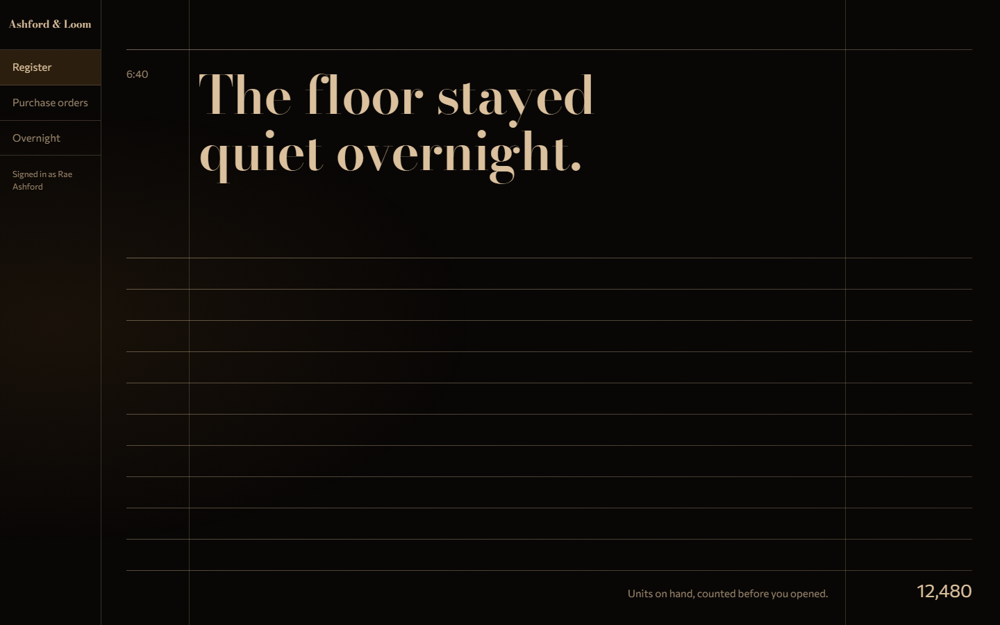
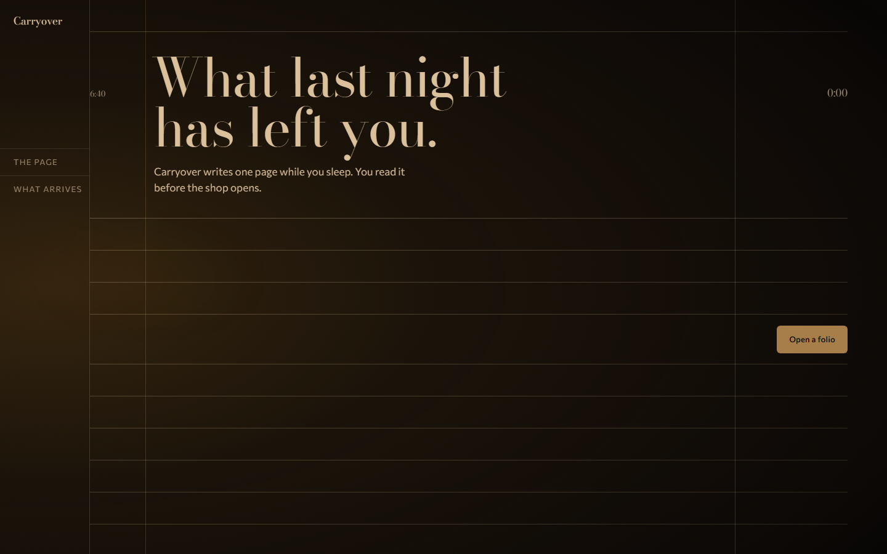

# Foldlight

UI identity from a remembered moment. A Claude Code skill that turns "Christmas morning, first coffee, before anyone is up" into a page that a stranger feels and cannot name: a fold chosen from a document atlas, a light kit sampled from a rendered plate, type picked from a live catalog and confirmed on a specimen, copy shaped by six dials, and linters that read the rendered pixels instead of the prose.

Rule zero: carry the light and the feeling, never the props.

## Before and after

Same moment, same product register. Left: what the v1 skill produced (a sidebar, four cards, a table). Right: the v2 ledger fold.

| v1 | v2 |
|---|---|
|  |  |

The landing page for the same moment, built through the shipped scripts and green on every check:



## Install

```
git clone https://github.com/ucsandman/foldlight
# Windows: junction, so the skill tracks the repo
cmd /c mklink /J "%USERPROFILE%\.claude\skills\foldlight" "C:\path\to\foldlight"
# macOS, Linux
ln -s "$PWD/foldlight" ~/.claude/skills/foldlight
```

Needs Node 18+ and `npx --yes playwright` (Chromium is fetched on first use). No npm dependencies.

## Use

```
/foldlight the first crisp day of fall, jeans and a sweatshirt weather, for: dashboard
```

Surfaces: `landing`, `dashboard`, `theme` (light and dark from one moment), `terminal`. The skill runs nine gated steps and shows each gate in its reply; no UI code is written before the fold card has been rendered and read.

1. Probe the project (existing fold, plate, tokens, fonts).
2. Capture the moment in the user's words; twelve inventory rows, Light as a record.
3. Block the page: Gaze x Document resolves to one of twelve folds with a CSS grid recipe and a numeric silhouette envelope.
4. Render the plate (a procedural light study by default, a photograph when a key resolves), sample the five OKLCH roles and the light kit out of it, lint.
5. Type by catalog query and a rendered specimen; voice dials and the six mandatory state strings.
6. Render the fold card and read it.
7. Build the first viewport, measure its silhouette, rebuild once.
8. Verify on pixels and DOM: silhouette, craft, tokens, copy, fold bands, reduced motion.
9. Write the brief last, as a record of what was built.

## Scripts

| Script | What it does |
|---|---|
| `context.mjs` | Project probe: existing moment, tokens, fonts, fold, plate |
| `fold.mjs` | Gaze x Document to a fold; twelve entries, 37 aliases, recipe, envelope, blocking diagram |
| `silhouette-lint.mjs` | Decodes a screenshot, thresholds it to a blob map, rejects the SaaS and Awwwards folds and any page that declared a fold it does not have |
| `shot.mjs` | Compiles the camera and lighting record from the inventory; `--check` fails on a prop in the prompt |
| `plate.mjs` | Renders the plate (procedural, or `--provider openai|gemini`, or `--import`) |
| `plate-tokens.mjs` | Samples bg, surface, ink, accent, muted and the light kit out of the plate; `--twin` for the theme pair |
| `moment-lint.mjs` | The token linter and PreToolUse hook: cream trap, indigo band, contrast, muted contrast, fold declared, light kit, timid type, reflex fonts with provenance, travel budget, twin-is-a-switch, plate drift |
| `fonts.mjs` | Queries Google Fonts and Fontshare by the lettering's physical qualities; writes the specimen sheet |
| `copy-lint.mjs` | Twelve copy rules plus state coverage; also a PreToolUse hook |
| `craft-lint.mjs` | Playwright DOM measurement: painted contrast, concentric radii, hairlines, tabular figures, tap targets, focus walk, motion twin, fold budget |
| `fold-metrics.mjs` | First-viewport numbers against bands measured from apple.com, stripe.com, linear.app and arc.net |
| `fold-card.mjs` | The one-page card read before any UI is built; `--sheet` tiles folds for a contact sheet |
| `selftest.mjs` | Atlas, alias and metric consistency; `--no-em-dash` over any files |

References: `references/folds.md` (the atlas), `light.md`, `imagery.md`, `type.md`, `voice.md`, `motion.md`, `fold-bands.md`, `translation.md`, `worked-examples.md`.

## Demos

Six moments, each built by running the skill end to end. Every folder holds the inventory JSON, the shot record, the plate, the tokens, the voice spec, the specimen, the fold card, the page, the screenshots and `MEASURED.md` with the verbatim linter lines. Status is what the linters print today, not a claim.

| Demo | Fold | Surface | Status |
|---|---|---|---|
| `christmas-morning-landing` | ledger | landing, brand | green on every check |
| `christmas-morning-dashboard` | ledger | dashboard, product | fold and tokens green; open craft-lint findings at 390 |
| `ferry-deck-landing` | ticket-stub | landing, brand | fold, craft and tokens green; one copy finding, mobile envelope open |
| `farmers-market-storefront` | receipt | storefront, brand, light theme | fold, tokens and copy green; seven craft findings |
| `christmas-morning-theme` | ledger | light and dark pack | tokens green; page still in progress |
| `first-fall-day-terminal` | field-notebook | terminal and editor theme | fold and tokens green; six craft findings; ships iTerm, Windows Terminal and VS Code theme files |

The open findings are listed line by line in each demo's `MEASURED.md`. The design record for the whole rewrite, including the tournament that chose the method, is `docs/superpowers/specs/2026-09-19-sense-memory-v2-design.md`.

## Evals

```
claude plugin eval . --ablation none --runs 1 --allow-tools Bash Write
```

Six cases: a dashboard from a given moment, a prompt with no moment (asks one question, writes nothing), a holiday brief that must not leak props, a landing fold that must pass the silhouette and craft linters, a second moment that must not land on the same fold, and a hook case that must report a denied write.

## Contributing

See `CONTRIBUTING.md`: no change to the workflow, the atlas or a generator merges until it has run end to end on the canonical moment and one unrelated moment with both fold screenshots attached.

MIT.
