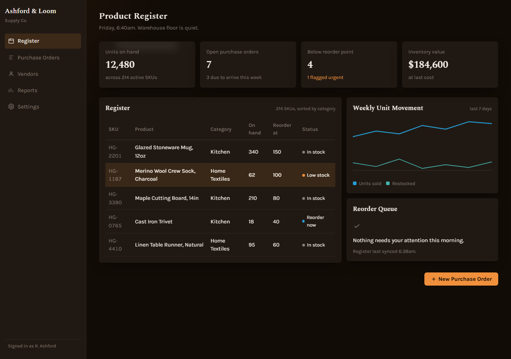
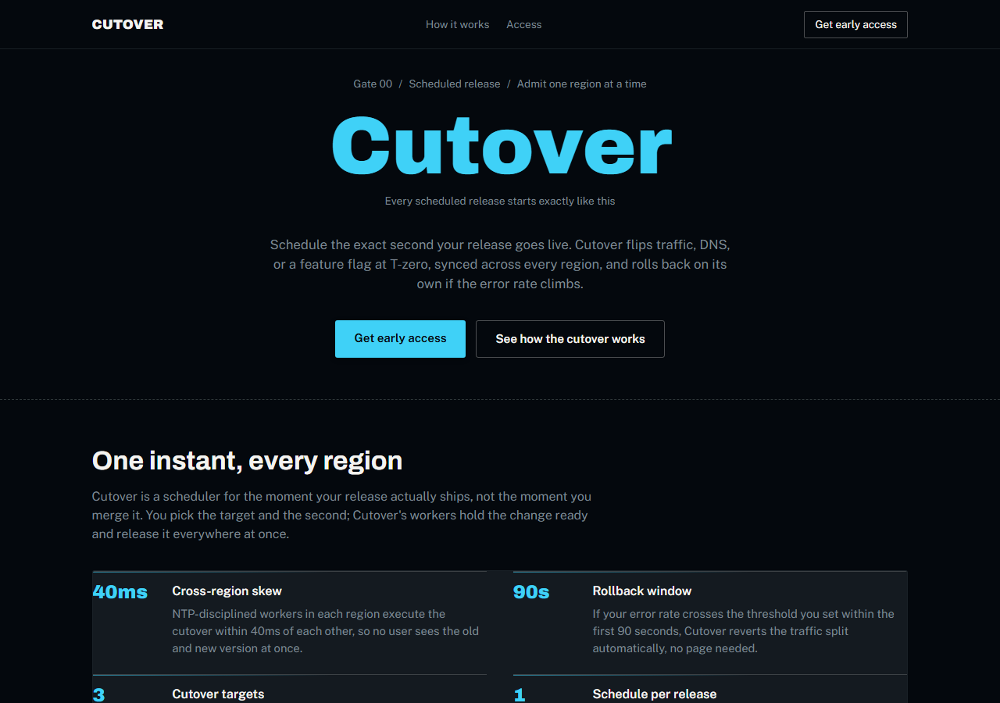
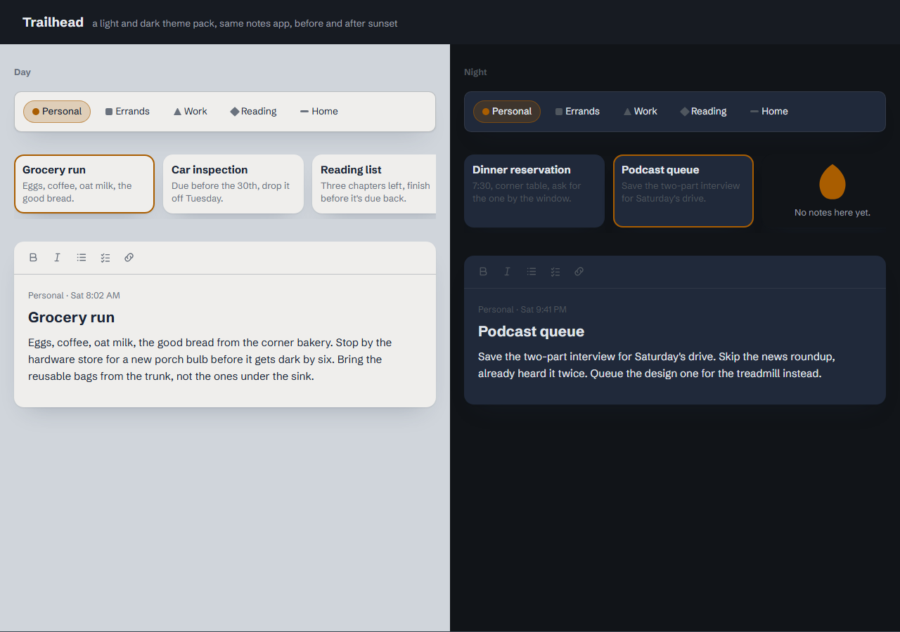
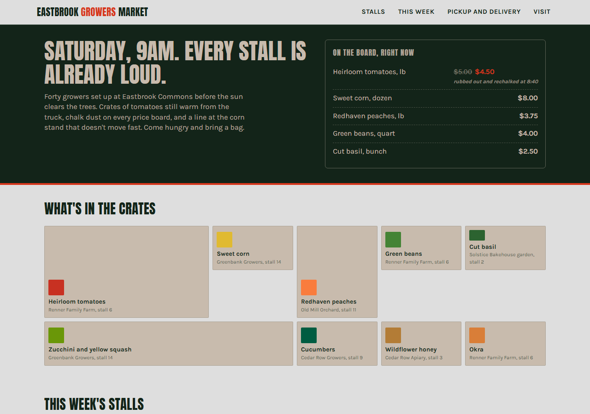
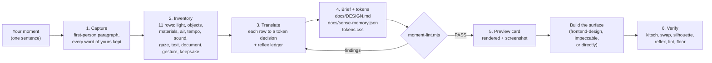

<div align="center">

# sense-memory

**A design skill for coding agents that starts from a moment you remember, not a template.**

Describe Christmas morning before anyone is up, or the ten seconds before the ball drops, or the first crisp day of fall. The skill turns that moment into light, palette, materials, tempo, composition, and one signature element, writes them as OKLCH tokens and a brief, lints them, renders a preview, and then builds the site, dashboard, or theme from that.

[](LICENSE)
[](#install)
[](#other-agents)
[](#evals)
[](#why-not-a-menu)

</div>

---

## What it makes

Four demos, each built from one sentence. Every one passes the skill's linter (no cream band, no indigo accent, no reflex fonts, contrast checked) and its kitsch test: a stranger feels the moment and cannot name it.

### 1. "Christmas morning, 6:40am, first coffee, one lamp on, the house is still asleep" → an ops dashboard

[](demos/christmas-morning-dashboard/index.html)

| From the scene | What it became |
|---|---|
| One tungsten lamp, 90 percent of the room in shadow | Dark theme; panels lighter than the page because they are what the lamp hits |
| Wood floor, mug glaze, lamp filament, steam | `--bg` wood floor in lamp shadow · `--surface` the mug's shadowed underside · `--ink` mug glaze under lamp light · `--accent` lamp filament · `--muted` steam |
| Ceramic, slow, near silence | 6px radius, no borders, 360ms ease-out-quint, no page-load sequence |
| Handwritten gift tags | Spectral for headings (pen-like stress, not a script face) over Karla |
| The keepsake: lamp light on steam | The signature: one fixed warm radial glow at the top-left of the shell, nowhere else |

Never: red-and-green pairing, snowflakes, a tree or gift icon, a "holiday" empty state. Pine appears once, as the selected-row tone.

### 2. "New Year's Eve, 11:59 in the square, everyone looking up, the ten seconds before the ball drops" → a launch page

[](demos/new-years-eve-launch/index.html)

| From the scene | What it became |
|---|---|
| Black sky, LED light from above | Dark theme with the lit elements as the content itself |
| Night sky, wool coats, jumbotron digits, the crystal ball, breath in cold air | `--bg` night sky · `--surface` the crowd's coats · `--ink` digit white · `--accent` the ball lit from inside · `--muted` breath |
| Held breath, then one burst | The display slot counts 10 to 0 once and lands the product name on zero; after that, stillness |
| Gaze up; the document is a ticket stub | Weight hangs from the top edge; exactly one tear line; access tiers as General Admission and Priority, not pricing cards |
| LED block digits | Archivo 900 for the count and headline over Public Sans |

Never: champagne, fireworks, confetti particles, gold-and-black, a year as a graphic.

### 3. "The first crisp day of fall, 8am, jeans and a sweatshirt weather, the perfect walk" → a light and dark theme pack

[](demos/first-fall-day-notes-theme/index.html)

| From the scene | What it became |
|---|---|
| Low gold sun, dry clear air | Light theme for the day; the same walk after dark for the night theme (same objects, different light, not an inversion) |
| Heather grey cotton, white sky near the sun, indigo denim, one yellow leaf, wet asphalt | Day: `--bg` sweatshirt cotton tinted toward the sky · `--surface` white sky · `--ink` denim · `--accent` the leaf · `--muted` the sweatshirt's shadow side. Night: `--bg` wet asphalt · `--surface` denim · `--ink` cotton · `--accent` the same leaf |
| Crisp, brisk, a crunch | 180ms ease-out-quart, no blur anywhere, tight leading |
| Gaze out and ahead; the document is a trail map | The note list is a wide low band; navigation reads as a legend |
| A woven neck tag | Schibsted Grotesk, one family at three weights |

The signature: one leaf-shaped clip-path in the accent, on the empty state only. Never: orange-and-brown, pumpkins, plaid, leaf icons in navigation.

### 4. "Saturday farmers market, 9am in August, tomatoes in wooden crates, chalkboard prices, everyone talking at once" → a storefront

[](demos/farmers-market-storefront/index.html)

| From the scene | What it became |
|---|---|
| Full morning sun, crowded and loud | Bright theme, dense layout, elements allowed to touch |
| Sun-bleached pavement, crate wood, chalkboard slate, a tomato, chalk dust | `--bg` pavement at chroma 0 · `--surface` crate wood in sun · `--ink` chalkboard slate · `--accent` a tomato · `--muted` chalk dust |
| The document is the chalked price list | The hero is a running item-and-price column, not a headline and subhead; the crates section varies card size instead of repeating one |
| Shouted produce-stand pricing | Anton for display over Karla |
| The keepsake: a price rubbed out and rechalked | The signature: one struck-through price on the board with the new number beside it, once |

Never: gingham, basket or leaf icons, "farm fresh" script lettering.

Each demo folder also has a `screenshot-mobile.png` at 375px.

Open any `demos/*/index.html` in a browser. Each folder also holds the `brief.md` the skill wrote and the `tokens.css` it linted.

## Why every AI site looks the same

Models output the statistical median of their training data. Ask for a landing page and you get the median landing page: cream background, terracotta accent, Inter, a centered hero, three identical cards. Every "anti-slop" fix so far works by refusal (ban lists of fonts and colors) or by menu (eight aesthetic anchors, fifteen styles, six hero architectures, a library of named brands to clone). A ban list only moves the median. A menu is a closed set, and a bigger menu is a bigger monoculture: the newest "premium" look (viewport-scale headline, monospace micro-labels, pill nav, dark cinematic scrim) is already as recognizable as the SaaS card kit it replaced.

A moment you remember is the one input no other prompt shares. Derive everything from it and the design cannot converge on the median, because the median has never been in that room.

## How it works



**Rule zero: carry the light and the feeling, never the props.** Christmas morning is not red, green, and snowflakes. It is one lamp, the glaze on a mug, wool, unhurried time, and a house that is still asleep.

### The inventory

| Row | Becomes |
|---|---|
| Light | Dark or light theme (decided by the scene, never by default), the brightest surface, shadow direction |
| Objects | The five palette roles in OKLCH, each named after the object it came from |
| Materials | Radius, border weight, texture, shadow stack |
| Air | Spacing density and layout openness |
| Tempo and sound | Durations, easing shape, whether there is a page-load moment at all |
| Gaze | Composition: where the weight sits, where the primary action lives |
| Text in the scene | The type direction as a physical object (a gift tag, LED digits, a woven label), then a real catalog search |
| The document | The organizing genre of the page: a ticket stub, a trail map, a receipt, a field notebook |
| The gesture | The interaction signature on hover, press, and confirm |
| The keepsake | The one signature element the framework does not ship |

### The reflex ledger

For every axis the skill writes down the default it would have reached for on a generic brief, then what the scene gave instead. An axis whose scene value equals its reflex is not translated yet. The ledger ships inside the brief so the next session inherits the reasoning, not just the hex values.

### The checks

| Check | Passes when |
|---|---|
| Kitsch | A stranger cannot name the holiday, season, or event from the screen |
| Cream trap | Neither `--bg` nor `--surface` sits in the warm near-white band (OKLCH L .84 to .98, hue 40 to 100), and no token is named cream, bone, paper, or linen |
| Swap | A different moment would change bg, ink, accent, tempo, composition, and the signature |
| Silhouette | Reduced to a 200px black-on-white silhouette, the layout is not the category's default |
| Awwwards lane | No viewport-scale headline, mono micro-labels, pill nav, or cinematic scrim unless a scene row produced it |
| Lint | `moment-lint.mjs` reports `findings=0` with the role count shown |
| Floor | 4.5:1 body contrast, visible focus, reduced-motion alternative, no overflow at 375px |

## Install

### Claude Code

```bash
git clone https://github.com/ucsandman/sense-memory ~/.claude/skills/sense-memory
```

That is the whole install. The skill registers itself from `SKILL.md`. Then, in any project:

```
/sense-memory Christmas morning, 6:40am, first coffee, one lamp on, the house still asleep. For the ops dashboard.
```

Or just say what you want in plain words: "make this dashboard feel like the first crisp day of fall". The skill triggers on "feel like", on a season, a place, a ritual, or "this looks like every other AI site".

What the Claude Code version adds on top of the markdown:

- **A lint hook.** Once the skill is invoked, every `Write` and `Edit` for the rest of the session runs `scripts/moment-lint.mjs`. A token file that drifts back to cream, indigo, Inter, or a bounce easing is denied with the findings as the reason. The hook resolves the script through `$HOME/.claude/skills/sense-memory`; if you cloned elsewhere, edit that one line in `SKILL.md`.
- **A project probe.** `scripts/context.mjs` reports whether a moment is already persisted, which token file to write into, the fonts already committed, and a register hint. If the shell is unavailable the skill falls back to reading the files itself; nothing in the workflow depends on the shell.
- **A preview card.** `scripts/preview.mjs` renders the five swatches, the display face, a panel with a selected row, and the primary button so you can run the stranger test on real pixels before any page exists.

### Other agents

Codex, Cursor, Gemini CLI, and anything else that reads markdown context: copy `SKILL.md`, `references/`, and `scripts/` into your agent's skills or rules folder and reference the skill in your prompt. The hook and the shell-preprocessing block are Claude Code features; the workflow, the checks, and the three scripts run anywhere Node does.

## What gets written

| File | What it holds |
|---|---|
| `docs/DESIGN.md` | The brief: moment, register, light, palette with object names, material, composition, type, motion, signature, reflex ledger, and a never-list of three literal props |
| `docs/sense-memory.json` | The same, structured, so scripts and later sessions read data instead of prose |
| your token file | `tokens.css`, `@theme`, `tailwind.config`, or whatever the repo already uses, matched in format; first line `/* Sense memory: <title> */`, every role with its object as a trailing comment |
| `docs/sense-memory-preview.html` and `.png` | The rendered moment card |

Persisting is the point. A brief on disk is what stops the next AI session from regressing everything to indigo.

## Scripts

All three are dependency-free Node.

```bash
node scripts/context.mjs [dir]                 # project probe, never exits non-zero
node scripts/moment-lint.mjs tokens.css        # PASS/FAIL with counts; exit 1 on findings
node scripts/moment-lint.mjs --json tokens.css # machine-readable
node scripts/moment-lint.mjs --hook            # PreToolUse payload on stdin, deny JSON on stdout
node scripts/preview.mjs tokens.css out.html --signature "one sentence"
```

The linter catches: the cream band on `bg` and `surface`; an indigo-band accent; ink contrast under 4.5:1 and accent contrast under 3:1; any non-accent role with chroma over 0.08; tell names (`--cream`, `--bone`, `--paper`, `--linen`, `--oatmeal`); tell hexes (Tailwind indigo-500 and blue-500, Bootstrap blue, the Claude terracotta, `#F4F1EA`); the reflex-reject font list; em dashes; bounce and elastic easing; fewer than five roles. It converts OKLCH to sRGB itself.

## Evals

The skill ships an eval suite for `claude plugin eval`: a dashboard from a given moment, a request with no moment (the skill must ask one question and write nothing), and a holiday brief that must not leak props.

```bash
cd ~/.claude/skills/sense-memory
claude plugin eval . --ablation none --runs 1 --allow-tools Write
```

Graders are a mix of deterministic checks over the produced token file (five OKLCH roles present, no tell names, no reflex fonts) and short PASS/FAIL rubrics for a judge model. On Windows the eval sandbox refuses Bash grants, so run the suite Write-only there and the full suite on Linux or macOS.

## Why not a menu

Every other approach we audited before writing this (eleven repos, from the 88k-star taste skill to the brand-clone libraries) steers the model with a closed set: a font shortlist, six hero architectures, fifteen named styles, 138 brand skins. Closed sets feel like variety and produce a new monoculture. This skill has no presets, no aesthetic families, no named brands. If a step produces "this is basically Linear", the step is wrong and the fix is upstream in the inventory.

What it borrowed instead: mechanical gates that print their counts, a rejection ledger, the idea that a real document genre can organize a page, the silhouette test, and a drift rule (when output regresses late in a conversation, re-read the persisted brief and rebuild the failing axis; never argue with the hook).

## Pairs with

- **frontend-design** and **impeccable** build the UI; this skill produces the brief they build from. Paste the brief as the design direction.
- **de-vibe** audits an existing project for AI tells; run sense-memory afterwards to replace the defaults it found with an identity.
- **dataviz** owns chart series colors. A dashboard's moment lives in the neutrals, light, density, and tempo; data colors stay semantic.

## FAQ

**Does it work for product UI, or only landing pages?**
Both, at different volumes. A landing page carries the moment loudly. A dashboard carries it the way a room feels at six in the morning on a Tuesday: neutrals, light, density, motion tempo, the interaction signature. Buttons stay buttons, navigation stays where it was.

**What if I give it two moments?**
It asks which one is the home screen. Two moments is a mood board.

**Will it produce the same thing twice?**
Not from two different moments. The swap test is a gate: if a different moment would not change the background, ink, accent, tempo, composition, and signature, the skill is not done.

**Does "cozy" turn into cream and terracotta?**
That is the saturated AI default of 2026 and the linter blocks it on both near-white roles. Warmth comes from the light source, the material, and the tempo; the background is the object the light falls on.

## Layout

```
SKILL.md                      the skill (frontmatter: hooks, allowed-tools, argument-hint)
references/translation.md     sense-to-token rules, the checks, volume by surface
references/worked-examples.md three moments run end to end, for calibration
scripts/context.mjs           project probe
scripts/moment-lint.mjs       the gate
scripts/preview.mjs           the moment card
evals/                        three cases for claude plugin eval
demos/                        four built pages with their briefs and tokens
```

## License

MIT. Built by [Wes Sander](https://github.com/ucsandman) after a question on r/ClaudeCode about skills that give a site an identity rather than a copy.
